# Lexos: Event-Driven AI Document Processing Engine

[](https://go.dev/)
[](https://python.org/)
[](https://nextjs.org/)
[](https://redis.io/)
[](https://min.io/)
[](https://github.com/ggml-org/llama.cpp)
[](https://github.com/cauafsantosdev/lexos/actions/workflows/ci.yml)
[](LICENSE)

**[Live Application: lexos.cauafsantos.dev](https://lexos.cauafsantos.dev)**

**Lexos** is a cloud-native, event-driven AI document processing engine built around self-hosted language models. It combines a high-concurrency Go gateway with asynchronous Python workers to execute document summarization, retrieval-augmented generation, and speech transcription without blocking HTTP request handling or relying on external AI APIs.

---

## Demo

[Demo Video](https://github.com/user-attachments/assets/23674ff6-70c6-4da1-9821-1eba5aef3f60)

---

## Key Features

* **Self-Hosted and Privacy-Focused:** Document parsing, embeddings, vector retrieval, transcription, and LLM inference run within the self-hosted Docker environment. Lexos does not require external AI APIs or send user content to third-party model providers during processing.
* **Asynchronous Processing:** Clients receive an immediate `202 Accepted` response with a task identifier while CPU-intensive workloads continue in the background, preventing long-running transcription and document-processing requests from blocking HTTP connections.
* **Real-Time Answer Streaming:** Gleaner uses Server-Sent Events to stream generated answers token by token from the Python worker, through Redis Pub/Sub and the Go gateway, to the browser.
* **S3-Compatible Object Storage:** MinIO provides development storage while Cloudflare R2 provides production storage through the same S3-compatible client configuration.
* **Content-Addressed Processing:** SHA-256 fingerprints combine source content, operation, and operation-specific parameters to reuse completed artifacts and suppress concurrent duplicate processing.
* **Multilingual Document Retrieval:** Gleaner uses multilingual embeddings, tokenizer-aware chunking, and FAISS cosine-similarity search to retrieve relevant evidence across supported languages.
* **Isolated Automated Testing:** Go handlers use dependency-injected Redis and object-storage interfaces, while Python tests mock models, storage, and network operations through Pytest and `pytest-mock`. This allows core business and pipeline logic to be tested without loading production ML models or requiring live infrastructure.

---

## System Architecture

Lexos uses a decoupled, event-driven architecture that separates the user interface, high-concurrency API gateway, infrastructure services, and CPU-bound machine learning workloads. This allows each layer to evolve and scale independently without coupling HTTP request handling to model inference.



### 1. Frontend (Next.js)

* **Developer-Focused Interface:** Provides dedicated workflows for audio transcription, document summarization, and retrieval-augmented question answering.
* **Asynchronous Task Tracking:** Uses TanStack Query to poll task state without blocking the interface.
* **Real-Time QA:** Consumes Server-Sent Events from the Go gateway and renders generated answers token by token.
* **Typed API Integration:** Communicates with the backend through a centralized TypeScript API client following the gateway's fixed contracts.

### 2. API Gateway (Go + Echo)

* **Ingestion & Validation:** A lightweight Go binary handles all incoming HTTP traffic, parses multipart file uploads, and validates payloads.
* **Storage Proxy:** Streams incoming documents and audio files directly to S3-compatible object storage while calculating SHA-256 content hashes in the same pass.
* **Task Dispatch:** Generates unique `task_id`s, writes task state to Redis Hashes, acquires fingerprint-scoped distributed locks, and pushes only cache misses onto service-specific Redis lists.
* **Duplicate Suppression:** Completed fingerprints reuse existing derived artifacts, while concurrent duplicate uploads attach to the already-running owner task instead of launching duplicate ML inference.
* **SSE Proxy:** Subscribes to Redis Pub/Sub channels to stream LLM generation tokens back to the client in real-time via Server-Sent Events.

### 3. The Broker (Redis)

* **State Management:** Acts as the single source of truth for task statuses (`queued`, `processing`, `completed`, `failed`) with bounded task TTLs.
* **Processing Cache:** Stores short-lived fingerprint metadata that maps reusable computations to content-addressed result and index objects.
* **Distributed Locks:** Uses atomic `SET NX` leases to prevent simultaneous duplicate requests from enqueueing redundant worker jobs while a processing lease is active.
* **Message Queues:** Buffers workloads so the Python worker is never overwhelmed, ensuring CPU-intensive ML tasks are processed sequentially without saturating the host.

### 4. AI Worker (Python + Llama.cpp)

* **Polling Engine:** An infinite loop continuously polls Redis queues, validates reusable cache entries, and downloads required raw artifacts from S3-compatible storage into temporary local storage.
* **Distiller (Summarization):** Uses the Qwen GGUF tokenizer to split large documents by model-token budget with overlapping context, then feeds the resulting chunks through a Map-Reduce pipeline powered by **Qwen3 (0.6B)**.
* **Gleaner (RAG):** Splits documents along exact tokenizer boundaries using the model’s Rust-based Hugging Face tokenizer, generates multilingual embeddings through **FastEmbed**, persists **FAISS** indexes, and retrieves grounded context for **Qwen**-powered question answering.
* **Scriber (Audio):** Processes audio files through **Faster-Whisper** for offline, CPU-optimized transcription.

### 5. Object Storage (MinIO / Cloudflare R2)

* **Development Backend:** MinIO provides a local S3-compatible target with lifecycle rules applied automatically by Docker Compose.
* **Production Backend:** Cloudflare R2 uses the same storage abstraction through its S3-compatible endpoint.
* **Raw Inputs:** Objects under `raw/` expire after one day. Duplicate raw uploads are removed immediately when an existing computation can be reused.
* **Derived Cache:** Redis exposes completed artifacts as reusable cache entries for seven days. The corresponding `cache/` objects are retained for eight days, leaving a one-day access grace period for task aliases created near cache expiry.

---

## Resource-Aware Deployment

Lexos was designed to run on a small, CPU-only VPS while sharing resources with other applications. Its architecture and model choices intentionally prioritize predictable memory usage, controlled CPU consumption, and low operational cost.

* **Quantized Local Generation:** Qwen3 0.6B runs as a `Q4_K_M` GGUF model through llama.cpp, reducing model storage and memory requirements compared with full-precision PyTorch inference.
* **Memory-Mapped Model Loading:** llama.cpp uses memory-mapped GGUF files, enabling demand-paged loading and allowing the host operating system to reuse mapped pages when compatible processes access the same model file.
* **ONNX-Based Embeddings:** FastEmbed runs the multilingual E5 embedding model through ONNX Runtime without loading the PyTorch or Transformers inference stack.
* **Lightweight Vector Retrieval:** Per-document FAISS `IndexFlatIP` indexes provide cosine-similarity search without requiring a separate vector database service.
* **Controlled Worker Concurrency:** CPU-heavy workloads are processed sequentially by the worker, with inference threads intentionally limited to prevent a single task from monopolizing the host.
* **Externalized State and Artifacts:** Redis and S3-compatible object storage remove the need for shared local volumes, keeping gateway and worker containers independently deployable.
* **Compute Deduplication:** Content fingerprints prevent repeated Qwen, Faster-Whisper, and embedding work for identical inputs while matching content and request parameters remain valid.
* **Deployment Target:** The complete stack is suitable for a VPS-class environment with approximately 4 virtual CPUs and 8 GB of RAM, while the AI worker is designed around an approximate 2 GB memory budget.

---

## Tech Stack

* **Gateway:** Go (Golang), Echo Framework
* **Worker:** Python 3.14
* **UI:** Next.JS 16, Tailwind CSS
* **Infrastructure:** Docker Compose, Redis, MinIO (development), Cloudflare R2 (production)
* **Machine Learning:** Llama.cpp (Qwen3), Faster-Whisper, FastEmbed, FAISS
* **Testing:** Testify (Go), Pytest / Pytest-Mock (Python)

---

## Project Structure

```text
lexos/
├── gateway/              # Go API Gateway
│   ├── cmd/server/       # Main entry point
│   └── internal/
│       ├── handlers/     # HTTP route controllers and Dependency Injection
│       ├── mocks/        # testify/mock auto-generated interfaces
│       ├── queue/        # Redis connection and logic
│       ├── routes/       # Endpoint declaration
│       └── storage/      # S3-compatible streaming and retrieval
├── worker/               # Python ML Worker
│   ├── src/
│   │   ├── broker/       # Redis consumer loop and task router
│   │   ├── services/     # Distiller, Gleaner, and Scriber ML pipelines
│   │   ├── utils/        # File parsing, prompting, and singleton model loaders
│   │   └── main.py
│   └── tests/            # Isolated Pytest suite for data pipelines
├── frontend/             # Next.js web interface
│   ├── app/              # App Router pages
│   ├── components/       # Neo-brutalist UI components
│   └── lib/              # Typed Go API client
├── docs/                 # Helper documentation files
├── infra/                # Object lifecycle configuration
├── docker-compose.yml    # Full infrastructure orchestration
└── .github/workflows/    # CI pipelines for Go and Python tests
```

---

## How to Run

Prerequisites: **Docker** and **Docker Compose** installed.

### 1. Clone & Boot

```bash
git clone https://github.com/cauafsantosdev/lexos
cd lexos
docker-compose up --build -d
```

*Note: The initial boot may take a few minutes as the Python container downloads and caches the GGUF, embedding, and Whisper model files. The MinIO initialization container also creates the development bucket and imports `infra/lifecycle.json`.*

### 2. Production Object Storage (Cloudflare R2)

Production uses the same `S3_*` configuration surface with an R2 endpoint and `S3_REGION=auto`. The bucket must exist before application startup. Example values are available in `.env.production.example`.

Apply the same raw/cache lifecycle policy to R2 with Wrangler:

```bash
npx wrangler r2 bucket lifecycle set <bucket-name> --file infra/lifecycle.json
```

The configured policy expires `raw/` objects after one day and `cache/` objects after eight days. Redis cache metadata remains reusable for seven days; the extra object-storage day provides an access grace period for task aliases created near cache expiry. Once Redis metadata expires, the next matching request naturally falls back to recomputation.

### 3. Test the API

Submit a document for summarization:

```bash
curl -X POST http://localhost:8000/summarize \
     -H "Content-Type: application/json" \
     -d '{"document_text": "Document text goes here...", "style": "executive"}'
```

Check the status using the returned `task_id`:

```bash
curl http://localhost:8000/task/<task_id>
```

---

## Engineering Decisions

### 1. Decoupling Compute from the API

Machine learning inference is heavily CPU-bound. If the API directly invoked the Python models, a burst of 5 summarization requests would lock the server, causing all subsequent traffic to time out. By inserting Redis as a broker, the Go gateway can continue accepting and validating requests while the Python worker safely drains the queue at its own pace.

### 2. Dependency Injection for Isolated Testing

Go Gateway handlers depend on strict queue and object-storage interfaces rather than concrete Redis or MinIO clients. Testify mocks can therefore validate payload handling, task state transitions, cache behavior, and HTTP routing without live infrastructure or network I/O.

### 3. Dual Chunking Strategies

Lexos utilizes two different chunking algorithms based on the architectural need:

* **Vector Retrieval (FAISS):** Uses strict, exact-character offset slicing mapped to a Rust-based HuggingFace Tokenizer. This ensures zero data mutation and respects strict model token limits for high-fidelity cosine similarity.
* **Summarization (Map-Reduce):** Uses Qwen's tokenizer directly through the Llama.cpp GGUF model to enforce source-token budgets against the 3,072-token generation context. Large documents are split into overlapping token windows before fact extraction and final Reduce synthesis.

### 4. Memory Mapping for LLMs

To run a 0.6B parameter model inside a Docker container without exhausting host RAM, the Llama.cpp engine is configured to load `.gguf` files. This utilizes OS-level memory mapping, allowing the CPU to page weights directly from the disk cache, keeping the container's active memory footprint extremely lean.

### 5. Content-Addressed Processing

Every expensive non-streaming pipeline is identified by a deterministic SHA-256 fingerprint derived from source content, operation, and processing-relevant request parameters. Uploaded files are hashed from their exact byte stream while being uploaded; direct Distiller text is hashed from its exact UTF-8 payload. File-based pipelines also include the normalized source extension because parsing and decoding can depend on the container format, while Distiller additionally includes the requested summary style. Redis stores the reusable artifact mapping and a fingerprint-scoped processing lease. Completed cache hits reuse existing artifacts immediately, and concurrent duplicates resolve to the already-running owner task while the lease remains active.

Raw uploads remain task-scoped because their one-day retention window should not be extended by later duplicate requests. When a duplicate can reuse cached or in-flight processing, the newly uploaded raw object is deleted immediately. Derived outputs remain content-addressed under `cache/`; Redis permits reuse for seven days and object storage retains the artifacts for eight days to protect late cache-hit task aliases.

---

## Testing

* **Go Gateway:** Testify mocks validate handler behavior, content fingerprints, cache hits, stale-lock recovery, object-storage access, and task result proxying without live Redis or S3 services.
* **Python Worker:** Pytest and `pytest-mock` validate cache ownership, token-aware indexing, Gleaner streaming cleanup, worker routing, artifact reuse, and failure recovery without loading production models.
* **Frontend:** GitHub Actions runs TypeScript type checking, ESLint, and a production Next.js build for every push and pull request targeting `main`.
* **CI Isolation:** Model inference and external network I/O remain mocked in unit tests, keeping correctness checks independent of production infrastructure.

---

## License

This project is licensed under the MIT License. See the `LICENSE` file for details.

---

## Contact

Cauã Santos – [LinkedIn Profile](https://www.linkedin.com/in/cauafsantosdev/) – cauafsantosdev@gmail.com

Project Link: [https://github.com/cauafsantosdev/lexos](https://github.com/cauafsantosdev/lexos)
